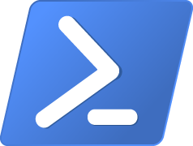
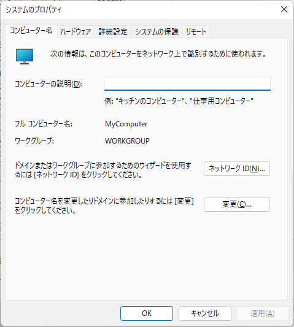

Windowsで普段使うちょっとした小技集です。Windowsを使い始めの方に読んでもらえれば幸いです。
Windows 11を想定していますが、多くのものがWindows 10でも使えると思います。

## ウィンドウを閉じる
- ウィンドウがアクティブになっている状態で`Alt + F4`
- （対応しているアプリケーションのみ）ウィンドウがアクティブになっている状態で`Ctrl + W`。タブまたはウィンドウを閉じる

## デスクトップを表示する
- `Win + D`。2回押すと元のウィンドウ状態に戻ります。1瞬だけデスクトップを表示したいとき便利です。
- `Win + M`。全アプリの最小化。2回押しても元には戻りません。

## Windowsをロックする
- `Win + L`

## キーボードでウィンドウを移動
- `Win + ←`：左に移動
- `Win + →`：右に移動
- `Win + ↑`：上に移動/最大化
- `Win + ↓`：下に移動/最小化
- `Win + Shift + ← or →`：マルチモニター間を移動
- `Win + Alt + ← or → or ↑ or ↓`：最大化・最小化せずにウィンドウ移動
- 最小化されていない状態で`Alt + Speace`の後に`M`その後、矢印キーで移動。  
※マウスカーソルにウィンドウが追従する状態となるため、画面外にウィンドウが表示されている状態でも救出することができます。

## タスクマネージャーでプロセスを終了
- `Ctrl + Shift + Esc`でタスクマネージャーを起動できます。
- `Ctrl + Tab`でタブを切り替えられます。
- `詳細`でタブで`Tab`を押した後、キーボードの英数入力でプロセスを前方一致検索できます。
- プロセス名が選択されている状態で`Delete`キー、続いて`Enter`キーを押すとプロセスを終了できます。

## コマンドでプロセス名を指定して終了
- `taskkill /f /im プロセス名`でプロセスを終了できます。
例えば、`taskkill /f /im explorer.exe`でエクスプローラーを終了できます

## コマンドでWindowsをシャットダウン
- `shutdown /s /t 0`でシャットダウンできます。追加で`/f`をつけると強制シャットダウンになります。

## コマンドでWindowsを再起動
- `shutdown /r /t 0`で再起動できます。追加で`/f`をつけると強制再起動になります。

## Windowsをログオフ/サインアウト
- `logoff`でログオフ/サインアウトできます。個人PCではあまり使うことはないかも？

## タスクバーのアイコンから複数同じプログラムを起動
- タスクバーで`Shift`キーを押しながら左クリックすると、複数同じプログラムを起動できます。（複数起動対応のアプリのみ）

## 管理者権限でプログラムを起動
- `Ctrl + Shift`を押しながらプログラムを起動すると管理者権限でプログラムを起動できます。

## エクスプローラーを起動
- `Win + E`でエクスプローラーを起動できます。
- `Win + R`で「ファイル名を指定して実行」を表示し`explorer`と入力して`Enter`

## エクスプローラーで開いている場所でコマンドプロンプトを開く
- Windows 11だと右クリックメニューの「ターミナル」からコマンドプロンプトを起動できます。
- また、アドレスバーに`cmd`と入力して`Enter`キーを押すとコマンドプロンプトを起動できます。

## コントロールパネルを開く

- `Win + R`で「ファイル名を指定して実行」を表示し`control`と入力して`Enter`

## メモ帳を起動

- `Win + R`で「ファイル名を指定して実行」を表示し`notepad`と入力して`Enter`  

## 電卓を起動

- `Win + R`で「ファイル名を指定して実行」を表示し`calc`と入力して`Enter`

## ペイントを起動

- `Win + R`で「ファイル名を指定して実行」を表示し`mspaint`と入力して`Enter`  

## PowerShellを起動

- `Win + R`で「ファイル名を指定して実行」を表示し`powershell`と入力して`Enter`  

## Visual Studio Codeを起動

- `Win + R`で「ファイル名を指定して実行」を表示し`code`と入力して`Enter`

## Excelを起動

- `Win + R`で「ファイル名を指定して実行」を表示し`excel`と入力して`Enter`  
※Excelがインストールされている場合のみ。

## Wordを開く

- `Win + R`で「ファイル名を指定して実行」を表示し`winword`と入力して`Enter`  
※Wordがインストールされている場合のみ。

## PowerPointを開く

- `Win + R`で「ファイル名を指定して実行」を表示し`powerpnt`と入力して`Enter`  
  ※PowerPointがインストールされている場合のみ。

## システム構成を開く

- `Win + R`で「ファイル名を指定して実行」を表示し`msconfig`と入力して`Enter`  

## システムのプロパティを開く

- `Win + R`で「ファイル名を指定して実行」を表示し`sysdm.cpl`と入力して`Enter`

## スクリーンキーボードを開く
- `Win + R`で「ファイル名を指定して実行」を表示し`osk`と入力して`Enter`

## ワードパッドを開く

- `Win + R`で「ファイル名を指定して実行」を表示し`wordpad`または`write`と入力して`Enter`

## レジストリエディタを開く

- `Win + R`で「ファイル名を指定して実行」を表示し`regedit`と入力して`Enter`

## 範囲を選択して画面をキャプチャー
- `Win + Shift + S`で範囲を選択して画面をキャプチャーできます。
- `Win + Print Screen`で全画面をキャプチャーできます。
- `Alt + Print Screen`で現在のウィンドウをキャプチャーできます。

## タスクバーに登録されたアプリの起動
- `Win + 数字キー`でタスクバーに登録されたアプリを起動できます。  
例えば`Win + 1`を押すとタスクバーの1番左のアプリが起動します。
- `Win + T`でタスクバーのアイコンにフォーカスを移動でき、続けて複数回`Win + T`を押したり、
 `←`または`→`で選択を移動させ`Enter`キーで選択されたアプリを起動できます。

## 拡大/縮小

- `Win + +`でWindowsの拡大鏡が起動します。さらに`Win + + or -`で画面の拡大/縮小ができます。
- メモ帳やブラウザなど`Ctrl + + or -`で拡大/縮小できる（対応しているアプリのみ）

## 標準のメッセージボックスの文字列はコピー可能
- `Ctrl + C`で標準のメッセージボックスの文字列をコピーできます。
