Windowsで普段使うちょっとした小技集です。Windowsを使い始めの方に読んでもらえれば幸いです。
Windows 11を想定していますが、多くのものがWindows 10でも使えると思います。

## ウィンドウを閉じる
- ウィンドウがアクティブになっている状態で`Alt + F4`
- ウィンドウがアクティブになっている状態で`Ctrl + W`。タブまたはウィンドウを閉じる（対応しているアプリケーションのみ）
- `Alt + Space`(システムメニューを開く) → `C`。ウィンドウを閉じる。
- ウィンドウのタイトルバーの左のアイコンをダブルクリックする
- ウィンドウのタイトルバーの`×`をクリックする

## デスクトップを表示
- `Win + D`。2回押すと元のウィンドウ状態に戻ります。1瞬だけデスクトップを表示したいとき便利です。
- `Win + M`。全アプリの最小化。2回押しても元には戻りません。

## 音声入力
- `Win + H`。音声入力を開始する。音声入力を終了するには`Esc`または再度`Win + H`を押す。

## エクスプローラで旧来の右クリックメニューを表示する
- `Shift + F10`またはアプリケーションキーを押す。アプリケーションキーはキーボードの右下にあるキーです。

## 範囲を選択して画面をキャプチャー
- `Win + Shift + S`で範囲を選択して画面をキャプチャーできます。
- `Win + Print Screen`で全画面をキャプチャーできます。
- `Alt + Print Screen`で現在のウィンドウをキャプチャーできます。

## タスクバーに登録されたアプリの起動
- `Win + 数字キー`でタスクバーに登録されたアプリを起動できます。  
  例えば`Win + 1`を押すとタスクバーの1番左のアプリが起動します。
- `Win + T`でタスクバーのアイコンにフォーカスを移動でき、続けて複数回`Win + T`を押したり、
  `←`または`→`で選択を移動させ`Enter`キーで選択されたアプリを起動できます。

## 拡大/縮小
- `Win + +`でWindowsの拡大鏡が起動します。さらに`Win + + or -`で画面の拡大/縮小ができます。
- メモ帳やブラウザなど`Ctrl + + or -`で拡大/縮小できる（対応しているアプリのみ）

## Windowsのロック
- `Win + L`
- `Ctrl + Alt + Del`→`Space` or `Enter`

## Windowsのシャットダウン
- `Win + M`や`Win + D`でデスクトップ表示した状態や`Win + T`や`Win + B`でタスクバーがアクティブな状態で`Alt + F4`を押すと下記のようなダイアログが表示されるので「シャットダウン」が選択されているのを確認して`Enter`
  `Win + R`→`Alt + F4`→`Alt + F4`でも可。
  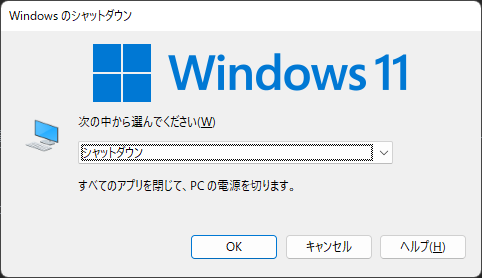
- `Win + X`→`U`→`U`でシャットダウンできます。
- コマンドプロンプトまたは`Win + R`の「ファイル名を指定して実行」で`shutdown /s /t 0`と入力するとシャットダウンできます。追加で`/f`をつけると強制シャットダウンになります。

## Windowsの再起動
- `Win + M`や`Win + D`でデスクトップ表示した状態や`Win + T`や`Win + B`でタスクバーがアクティブな状態で`Alt + F4`を押すと下記のようなダイアログが表示されるので1回`↓`を押して「再起動」を選択して`Enter`
　`Win + R`→`Alt + F4`→`Alt + F4`でも可。
  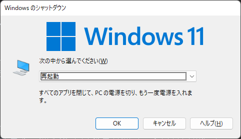
- `Win + X`→`U`→`R`で再起動できます。
- `shutdown /r /t 0`で再起動できます。追加で`/f`をつけると強制再起動になります。

## Windowsのスリープ
- `Win + M`や`Win + D`でデスクトップ表示した状態や`Win + T`や`Win + B`でタスクバーがアクティブな状態で`Alt + F4`を押すと下記のようなダイアログが表示されるので1回`↑`を押して「スリープ」を選択して`Enter`
  `Win + R`→`Alt + F4`→`Alt + F4`でも可。
  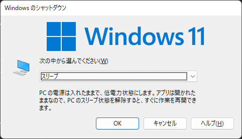
- `Win + R`→またはコマンドプロンプトで`rundll32.exe powrprof.dll,SetSuspendState`と入力すると休止状態にできます。

## Windowsのサインアウト（ログオフ）
- `Win + M`や`Win + D`でデスクトップ表示した状態や`Win + T`や`Win + B`でタスクバーがアクティブな状態で`Alt + F4`を押すと下記のようなダイアログが表示されるので2回`↑`を押して「サインアウト」を選択して`Enter`
  `Win + R`→`Alt + F4`→`Alt + F4`でも可。
  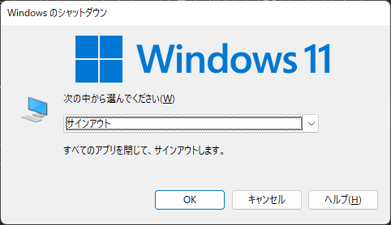
- `Win + X`→`U`→`I`
- `Ctrl + Alt + Del`→2回`Tab` or 2回`↓`→`Enter` or `Space`
- `logoff`でサインアウト（ログオフ）できます。

## キーボードでウィンドウを移動
- `Win + ←`：左に移動
- `Win + →`：右に移動
- `Win + ↑`：上に移動/最大化
- `Win + ↓`：下に移動/最小化
- `Win + Shift + ← or →`：マルチモニター間を移動
- `Win + Alt + ← or → or ↑ or ↓`：最大化・最小化せずにウィンドウ移動
- 最小化されていない状態で`Alt + Speace`の後に`M`その後、矢印キーで移動。  
※マウスカーソルにウィンドウが追従する状態となるため、画面外にウィンドウが表示されている状態でも救出することができます。

## タスクマネージャーでプロセスを終了
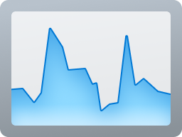
1. `Ctrl + Shift + Esc`でタスクマネージャーを起動できます。
2. `Ctrl + Tab`でタブを切り替えられます。
3. `詳細`でタブで`Tab`を押した後、キーボードの英数入力でプロセスを前方一致検索できます。
4. プロセス名が選択されている状態で`Delete`キー、続いて`Enter`キーを押すとプロセスを終了できます。

## コマンドでプロセス名を指定して終了
- `taskkill /f /im プロセス名`でプロセスを終了できます。
例えば、`taskkill /f /im explorer.exe`でエクスプローラーを終了できます

## タスクバーのアイコンから複数同じプログラムを起動
- タスクバーで`Shift`キーを押しながら左クリックすると、複数同じプログラムを起動できます。（複数起動対応のアプリのみ）

## 管理者権限でプログラムを起動
- `Ctrl + Shift`を押しながらプログラムを起動すると管理者権限でプログラムを起動できます。

## エクスプローラーを起動
- `Win + E`でエクスプローラーを起動できます。
- `Win + R`で「ファイル名を指定して実行」を表示し`explorer`と入力して`Enter`

## エクスプローラーで開いている場所でコマンドプロンプトを開く
- Windows 11だと右クリックメニューの「ターミナル」からコマンドプロンプトを起動できます。
- また、アドレスバーに`cmd`と入力して`Enter`キーを押すとコマンドプロンプトを起動できます。

## クリップボード履歴を表示
- `Win + V`でクリップボード履歴を表示できます。
過去にコピーしたテキストや画像を選択すると再度コピーできます。

## ファイル名を指定して実行
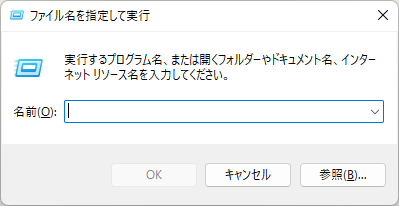
- `Win + R`で「ファイル名を指定して実行」が起動できます。

以下いくつか「ファイル名を指定して実行」またはコマンドプロンプトで実行できるコマンドの紹介します。

## Edgeを開く

- `msedge`と入力して`Enter`

## Internet Explorer 11（IE11）を開く
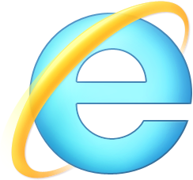
- `powershell.exe -Command "(New-Object -ComObject InternetExplorer.Application).Visible = $true"`と入力して`Enter`

## ターミナルを開く

- `wt`と入力して`Enter`

## コントロールパネルを開く

- `control`と入力して`Enter`
- `explorer.exe shell:::{26EE0668-A00A-44D7-9371-BEB064C98683}` でも開けます。

## メモ帳を起動

- `notepad`と入力して`Enter`  

## 電卓を起動

- `calc`と入力して`Enter`

## ペイントを起動

- `mspaint`と入力して`Enter`  

## PowerShellを起動

- `powershell`と入力して`Enter`  

## Visual Studio Codeを起動
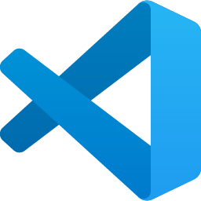
- `code`と入力して`Enter`

## Excelを起動

- `excel`と入力して`Enter`  
※Excelがインストールされている場合のみ。

## Wordを開く
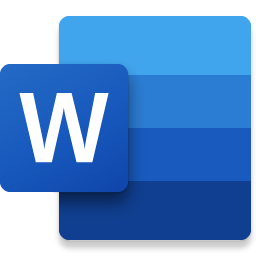
- `winword`と入力して`Enter`  
※Wordがインストールされている場合のみ。

## PowerPointを開く

- `powerpnt`と入力して`Enter`  
  ※PowerPointがインストールされている場合のみ。

## システム構成を開く
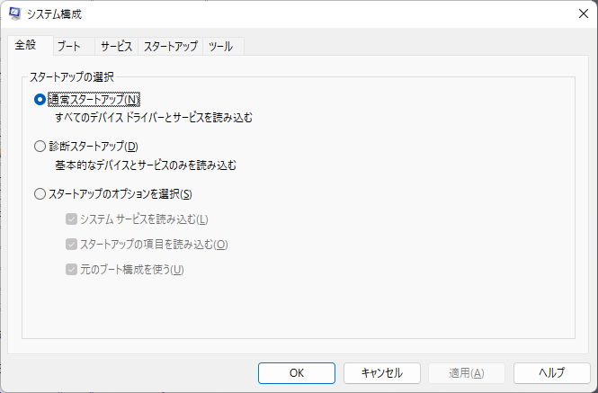
- `msconfig`と入力して`Enter`  

## システムのプロパティを開く

- `sysdm.cpl`と入力して`Enter`

## Windowsのバージョン情報を開く
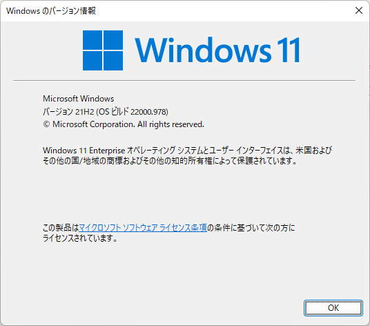
- `winver`と入力して`Enter`

## スクリーンキーボードを開く
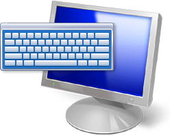
- `osk`と入力して`Enter`

## ワードパッドを開く

- `wordpad`または`write`と入力して`Enter`

## レジストリエディタを開く

- `regedit`と入力して`Enter`

## キーボードのプロパティを開く
- `explorer.exe shell:::{725BE8F7-668E-4C7B-8F90-46BDB0936430}`と入力して`Enter`

## サウンドを開く

- `explorer.exe shell:::{F2DDFC82-8F12-4CDD-B7DC-D4FE1425AA4D}`と入力して`Enter`

## プログラムと機能を開く
- `explorer.exe shell:::{7b81be6a-ce2b-4676-a29e-eb907a5126c5}`と入力して`Enter`

## プログラムと機能を開く
- `explorer.exe shell:::{7b81be6a-ce2b-4676-a29e-eb907a5126c5}`と入力して`Enter`

## マウスのプロパティを開く

- `explorer.exe shell:::{6C8EEC18-8D75-41B2-A177-8831D59D2D50}`と入力して`Enter`

## ユーザーアカウントを開く
- `explorer.exe shell:::{60632754-c523-4b62-b45c-4172da012619}`と入力して`Enter`

## 標準のメッセージボックスの文字列はコピー可能
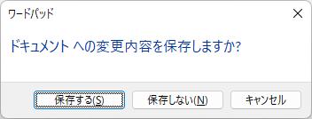
- `Ctrl + C`で標準のメッセージボックスの文字列をコピーできます。
上記のメッセージボックスをコピーすると下記がクリップボードにコピーされます。
```
[Window Title]
ワードパッド

[Main Instruction]
ドキュメント への変更内容を保存しますか?

[保存する(S)] [保存しない(N)] [キャンセル]
```

## 大きなフォルダーを高速一括削除
エクスプローラで大きなフォルダーを削除する場合は、フォルダーの内容を一旦全探索してから
削除が走るため速度が遅い。下記のようにコマンドで削除すると探索と削除が同時に実行されるため
大きなフォルダーを高速で削除することができます。

1. コマンドプロンプトで削除するフォルダーに移動し、`DEL /F /Q /S *.* > NUL`
2. 1つ上の階層に移動し、`RMDIR /Q /S フォルダー名`