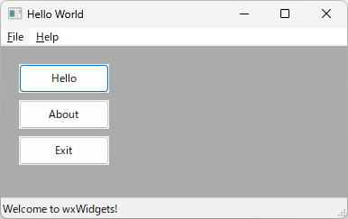

## wxWidgetsのインストール

1. https://www.wxwidgets.org/downloads/ を開いて`Windows Installer`をダウンロードします。
2. `wxMSW-3.2.2.1-Setup.exe`を実行してインストールします。
3. インストールされたフォルダから"C:\wxWidgets-3.2.2.1\build\msw\wx_vc17.sln"を開きます。
4. `wx_vc17.sln`を開いたら`ビルド`＞`バッチビルド`を選択します。
5. `すべて選択`ボタンを押下し、リビルドボタンを押下します。
6. ビルドが終了したらいったんVisual Studioを閉じる。

## サンプルプロジェクト作成

1. Visual Studioを開きます。
2. `ファイル`＞`新規作成`＞`プロジェクト`を選択します。
3. `Windows デスクトップ アプリケーション`（タブが`C++`、`Windows`、`デスクトップ`）を選択します。
4. `プロジェクト名`に`wxWidgetsSample`を入力します。
5. `作成`をクリックします。
6. `wxWidgetsSample`を右クリックし、`プロパティ`を選択します。
7. `構成プロパティ`＞`C/C++`＞`追加のインクルードディレクトリ`に`C:\wxWidgets-3.2.2.1\include`と`C:\wxWidgets-3.2.2.1\include\msvc`を追加します。
8. `構成プロパティ`＞`リンカー`＞`追加のライブラリディレクトリ`に`C:\wxWidgets-3.2.2.1\lib\vc_x64_lib`を追加します。
9. `wxWidgetsSample.cpp`を開き下記のコードに置き換えます。
```cpp
#pragma comment(linker,"\"/manifestdependency:type='win32' name='Microsoft.Windows.Common-Controls' version='6.0.0.0' processorArchitecture='*' publicKeyToken='6595b64144ccf1df' language='*'\"")

#include <wx/wxprec.h>

#ifndef WX_PRECOMP
#include <wx/wx.h>
#endif

class MyApp : public wxApp
{
public:
	virtual bool OnInit();
};

class MyFrame : public wxFrame
{
public:
	MyFrame();
private:
	void OnHello(wxCommandEvent& event);
	void OnExit(wxCommandEvent& event);
	void OnAbout(wxCommandEvent& event);
};

enum
{
	ID_Hello = 1
};

wxIMPLEMENT_APP(MyApp);

bool MyApp::OnInit()
{
	MyFrame* frame = new MyFrame();
	frame->Show(true);
	return true;
}

MyFrame::MyFrame()
	: wxFrame(NULL, wxID_ANY, "Hello World")
{
	wxMenu* menuFile = new wxMenu;
	menuFile->Append(ID_Hello, "&Hello...\tCtrl-H",
		"Help string shown in status bar for this menu item");
	menuFile->AppendSeparator();
	menuFile->Append(wxID_EXIT);
	wxMenu* menuHelp = new wxMenu;
	menuHelp->Append(wxID_ABOUT);
	wxMenuBar* menuBar = new wxMenuBar;
	menuBar->Append(menuFile, "&File");
	menuBar->Append(menuHelp, "&Help");
	SetMenuBar(menuBar);

	wxButton* button1 = new wxButton(this, ID_Hello, _("Hello"), wxPoint(20, 20), wxSize(100, 32));
	Connect(ID_Hello, wxEVT_COMMAND_BUTTON_CLICKED, wxCommandEventHandler(MyFrame::OnHello));

	wxButton* button2 = new wxButton(this, wxID_ABOUT, _("About"), wxPoint(20, 60), wxSize(100, 32));
	Connect(wxID_ABOUT, wxEVT_COMMAND_BUTTON_CLICKED, wxCommandEventHandler(MyFrame::OnAbout));

	wxButton* button3 = new wxButton(this, wxID_EXIT, _("Exit"), wxPoint(20, 100), wxSize(100, 32));
	Connect(wxID_EXIT, wxEVT_COMMAND_BUTTON_CLICKED, wxCommandEventHandler(MyFrame::OnExit));

	CreateStatusBar();
	SetStatusText("Welcome to wxWidgets!");
	Bind(wxEVT_MENU, &MyFrame::OnHello, this, ID_Hello);
	Bind(wxEVT_MENU, &MyFrame::OnAbout, this, wxID_ABOUT);
	Bind(wxEVT_MENU, &MyFrame::OnExit, this, wxID_EXIT);
}

void MyFrame::OnExit(wxCommandEvent& event)
{
	Close(true);
}

void MyFrame::OnAbout(wxCommandEvent& event)
{
	wxMessageBox("This is a wxWidgets' Hello world sample",
		"About Hello World", wxOK | wxICON_INFORMATION);
}

void MyFrame::OnHello(wxCommandEvent& event)
{
	wxLogMessage("Hello world from wxWidgets!");
}
```
10. ビルドして実行すると下記のようなウィンドウが開きます。




## 参考

サンプルプロジェクトを下記にあげています。
[wxWidgetsSample](https://github.com/kenjinote/wxWidgetsSample)

- [本家](https://www.wxwidgets.org)
- [C++と wxWidgets を使ったゲーム](https://ken-ohwada.hatenadiary.org/entry/2022/07/14/165213)

以上。
